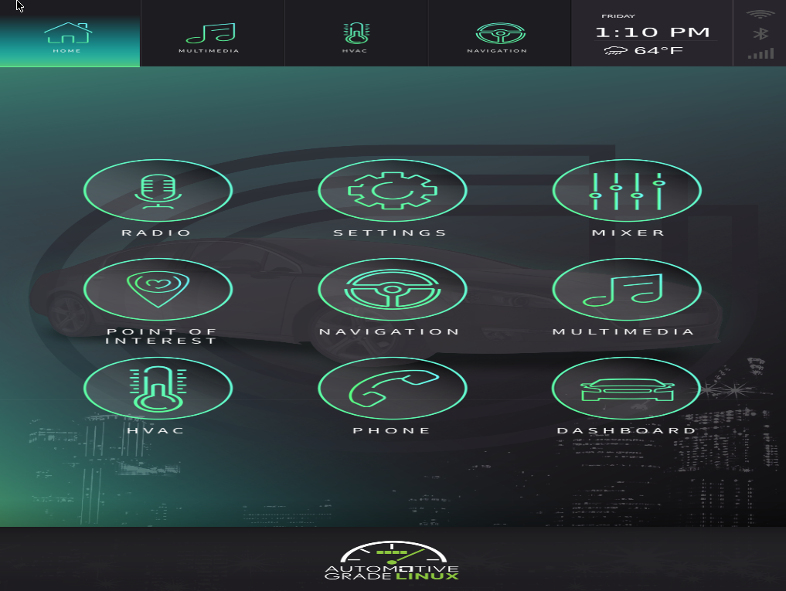
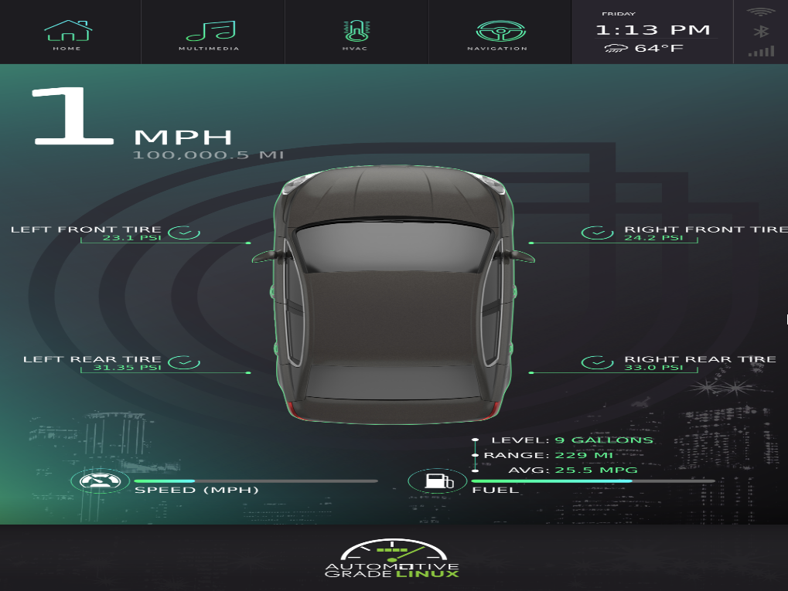

## agl_build

https://www.automotivelinux.org/

AGL(Automotive Grade Linux) Build Environment and Document

### Overview

Simple & Quick tutorial to download AGL source and build AGL image.

### Reference

- [AGL Source Code](https://git.automotivelinux.org/)
- [AGL Getting Started](https://docs.huihoo.com/automotivelinux/docs/getting_started/en/dev/reference/source-code.html)

### Tutorial

#### Yocto Requirement

https://www.yoctoproject.org/docs/2.4.4/ref-manual/ref-manual.html#detailed-supported-distros

as described above, Yocto supports Ubuntu 16.04 (LTS) at latest Ubuntu distribution.
So here it uses Ubuntu 16.04 docker container with required packages.

#### Build Docker Image

ubuntu 16.04 based docker images for build environment will be created as following.
this may take a few minutes.

```bash
# expecting current directory is this project root
> docker build -t agl:dev .
```

#### Getting Source Code

AGL source code will be fetched on host system(confirmed with Ubuntu18.04/20.04).

- Get `repo` command

```bash
> mkdir -p ~/bin
> export PATH=~/bin:$PATH
> curl https://storage.googleapis.com/git-repo-downloads/repo > ~/bin/repo
> chmod a+x ~/bin/repo
```

- Set working directory

```bash
> export AGL_TOP=$PWD/workspace_agl
> mkdir -p $AGL_TOP
```

- Download source code

```bash
> cd $AGL_TOP
> repo init -b dab -m dab_4.0.0.xml -u https://gerrit.automotivelinux.org/gerrit/AGL/AGL-repo
> repo sync
```

#### Build Image

- Start Container

```bash
> cd $AGL_TOP
> docker run -it -u $(id -u):$(id -g) -v $(pwd):$(pwd) -w $(pwd) agl:dev /bin/bash
```

the following procedure is required to run the container environment, not on the host system.

- Build information

```bash
> source meta-agl/scripts/aglsetup.sh -h
```

- Build & Run QEMU image

https://docs.huihoo.com/automotivelinux/docs/getting_started/en/dev/reference/machines/qemu.html

```bash
# Build image for QEMU
> source meta-agl/scripts/aglsetup.sh -f -m qemux86-64 agl-demo agl-devel
> bitbake agl-demo-platform
...
> cd tmp/deploy/images/qemux86-64
> xz -d agl-demo-platform-qemux86-64.vmdk.xz

# Run image on QEMU
> qemu-system-x86_64 -enable-kvm -m 2048 -hda agl-demo-platform-qemux86-64.vmdk -cpu kvm64 -cpu qemu64,+ssse3,+sse4.1,+sse4.2,+popcnt -vga std -show-cursor -device virtio-rng-pci -serial mon:stdio -serial null -soundhw hda -net user,hostfwd=tcp::2222-:22
```

choose Graphic boot and then you can see the dashboard.





- Build RasPi3 image

https://docs.huihoo.com/automotivelinux/docs/getting_started/en/dev/reference/machines/raspberrypi.html

```bash
> source meta-agl/scripts/aglsetup.sh -m raspberrypi3 agl-demo agl-netboot agl-appfw-smack
> bitbake agl-demo-platform
...
> cd tmp/deploy/images/raspberrypi3
> xz -d agl-demo-platform-raspberrypi3.rpi-sdimg.xz
```

then, see [how to flash the image](https://docs.huihoo.com/automotivelinux/docs/getting_started/en/dev/reference/machines/raspberrypi.html#booting-agl-demo-platform-on-raspberry-pi) to RasPi3 target board.

### Troubleshooting

- Ubuntu18.04/20.04 will fail to build image with following error.

```bash
| ../../m4-1.4.17/lib/fseeko.c: In function ‘rpl_fseeko’:
| ../../m4-1.4.17/lib/fseeko.c:109:4: error: #error "Please port gnulib fseeko.c to your platform! Look at the code in fseeko.c, then report this to bug-gnulib."
|   109 |   #error "Please port gnulib fseeko.c to your platform! Look at the code in fseeko.c, then report this to bug-gnulib."
|       |    ^~~~~
| ../../m4-1.4.17/lib/freadahead.c: In function ‘freadahead’:
| ../../m4-1.4.17/lib/freadahead.c:91:3: error: #error "Please port gnulib freadahead.c to your platform! Look at the definition of fflush, fread, ungetc on your system, then report this to bug-gnulib."
|    91 |  #error "Please port gnulib freadahead.c to your platform! Look at the definition of fflush, fread, ungetc on your system, then report this to bug-gnulib."
|       |   ^~~~~
| make[3]: *** [Makefile:1842: freadahead.o] Error 1
| make[3]: *** Waiting for unfinished jobs....
| make[3]: *** [Makefile:1842: fseeko.o] Error 1
```
